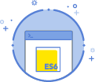

  

<h1 align="center">JavaScript (ES6)</h1>

A versatile language used anywhere from interactive websites to backend servers.

## JavaScript (ES6) I

ES6 is the future of JavaScript. It's the new standard for writing JavaScript that has become popular. In this first lesson, we'll cover the syntax and grammar including variables, constants and conditionals!

[Study 01](./study_01)

## JavaScript (ES6) II

In ES6 Study II you will learn how to use "iteration" to efficiently repeat sections of code. You'll also learn the basics of arrays and objects in this lesson.

[Study 02](./study_02)

## JavaScript (ES6) III

In JavaScript Study III, you will learn to combine efficiently combine and run code by creating functions. You'll also learn how to use the new ES6 arrow functions.

[Study 03](./study_03)

## JavaScript (ES6) IV

We'll learn about the JavaScript classes introduced in ES6 in this lesson.

[Study 04](./study_04)

## JavaScript (ES6) V

In JavaScript Study V, you will learn to use npm packages and create a project with multiple files!

[Study 05](./study_05)

## JavaScript (ES6) VI

In JavaScript Study VI, we'll cover methods for handling arrays that are essential for practical JavaScript development.

[Study 06](./study_06)
